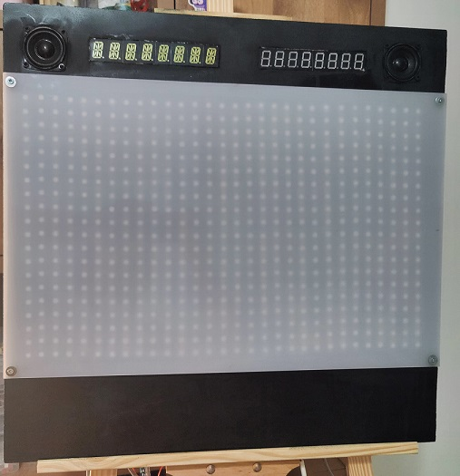
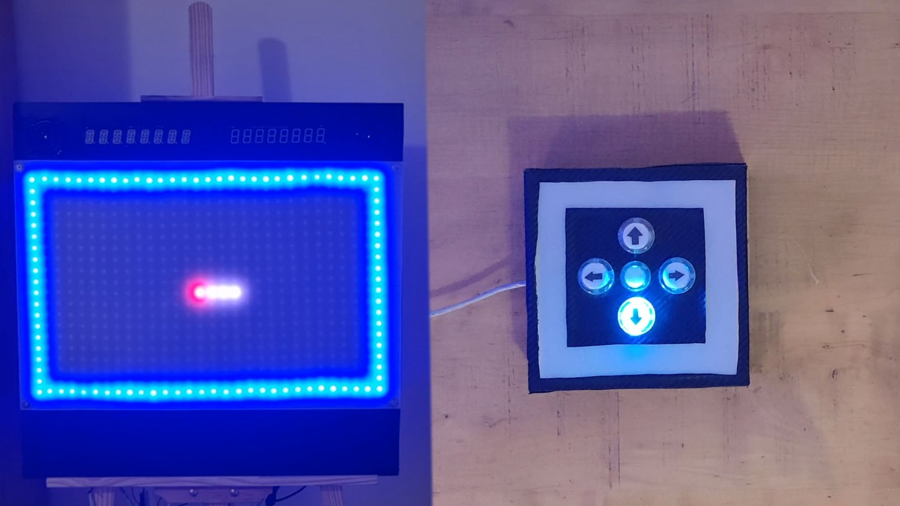
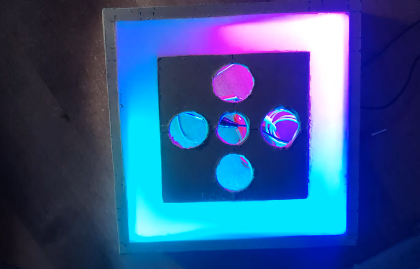
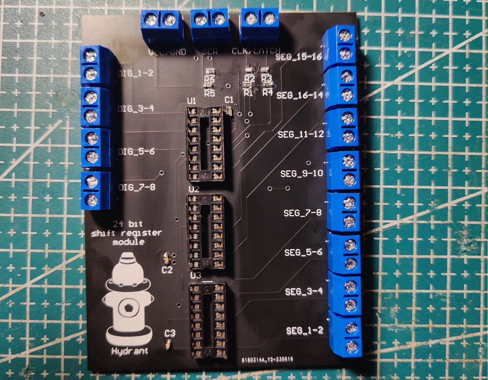
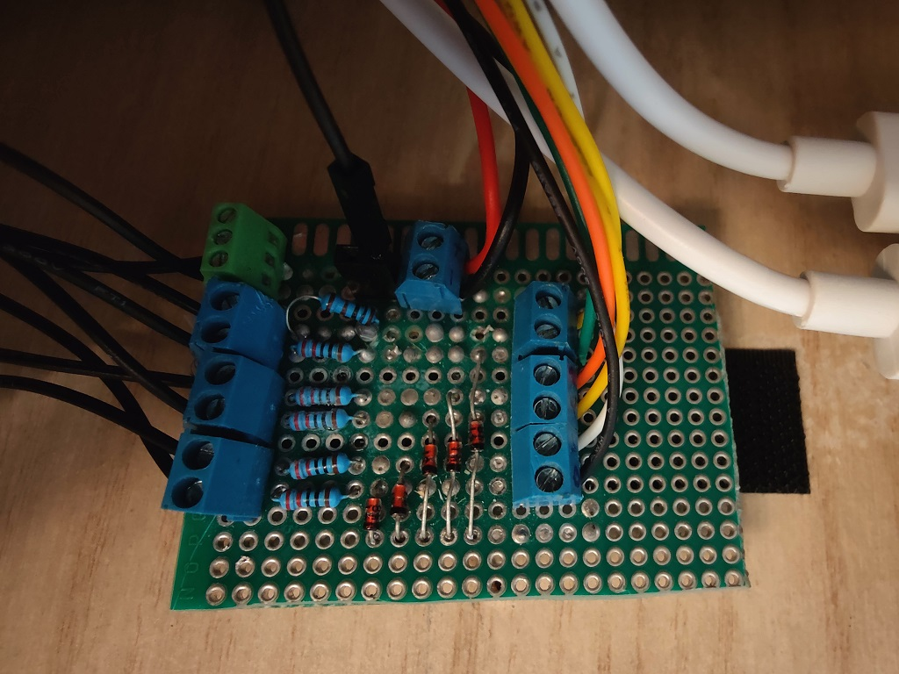

# Leds Screen
A python library designed to run games on a screen made out of [WS2812B](https://blog.hydrantz.com/wp-stuff/wp-content/uploads/2022/04/WS2812B.pdf) LEDs using a Raspberry Pi.

## Demos
Watch Gameplay Demo ↓

Watch Controller Effects Demo ↓

## Photos

### A custom made 24 bit shift register module, designed to manage data transmission to scoreboard. Shifting the signals allows using only 3 data lines (clock, latch, serial) instead of 128 data lines (8 digits X 16 segments per digits)

### A custom made PCB designed to manage data signals transfer between Raspberry Pi and Controller Hardware

## Dependencies
 - [Adafruit CircuitPython NeoPixel](https://github.com/adafruit/Adafruit_CircuitPython_NeoPixel)
 - [Adafruit Blinka](https://github.com/adafruit/Adafruit_Blinka)
 - [PySerial](https://github.com/pyserial/pyserial) (only when using custom-made controller)
 - [keyboard](https://github.com/boppreh/keyboard) (only for keyboard mode)

 ## Hardware
- [MASTER PINOUT](PINOUT_MASTER.md)
- [SLAVE PINOUT](PINOUT_SLAVE.md)